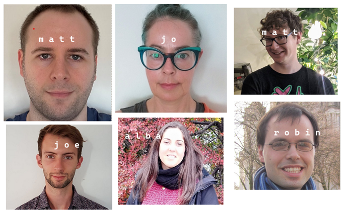

# A new RSE group, the first 100 days

## Who we are
_the 'who I am when I'm not working' approach_

* 6 people, various academic and software engineering backgrounds
* MJB - Weather-gazer, occasional dancer, photographer, reader, human: https://mattjbr123.github.io/
* JW - Mapper, hacker, choreographer, fitness instructor: https://github.com/metazool/ 
* MC - Pool player, TBD
* RL - Scout leader, TBD
* AGS - TBD
* JMR - "into things that grow, make sound or otherwise spark joy" 

## Where we are 

* The UK Centre for Ecology and Hydrology
* Not-for-profit independent research org (once NERC)
* Atmospheric chemistry, Biodiversity, Hydro-climate risks, Pollution, Soils and land use and Water resources 
* Runs the Environmental Information Data Centre for NERC
* Lots of environmental monitoring and modelling!
* Across 4 sites: Wallingford, Lancaster, Bangor, Edinburgh

[UKCEH Strategy 2025](https://www.ceh.ac.uk/sites/default/files/UKCEH-Strategy2025.pdf)

## Why we're here

* Generally: To help/guide/shape good software engineering practice in an academic setting
* Specifically: Provide expertise to specific projects in the most appropriate way
* Modelling, monitoring, data science and underlying Digital Research Infrastructure
* Working on reusable components across different areas of environmental research  

## What we're aiming for

* Not be seen as a "resource" or "pool", but as humans who can help!
* Make it easier for scientists to make good decisions about computers
* Create blueprints, templates and guides based on our experiences
* Help shape future national-scale Digital Research Infrastructure through UKCEH 
* Floods and Droughts Resilience Infrastructure (find and reuse hydrological data)
* National Capability UK (share, link and reuse environmental monitoring data)

[UKCEH - our national role](https://www.ceh.ac.uk/our-science/our-national-role)
[UKCEH Innovation Portfolio](https://www.ceh.ac.uk/our-science/innovation)

## Roles and functions

* Folks already in RSE or RSE-like roles, attached to groups or projects
* First attempt by UKCEH to build a central group - hired six of us at once!
* Our area of the org is "Environmental Data Science"
* social scientists, data scientists, devops specialists...  
* ... data stewards, UX researchers, semantics experts
* Flat team structure, trying to be conscious about communications norms 

## Culture building

* Ourselves - drafting a Team Agreement
* Our collaborators (EDS, Discussions)
* Our communities (researchers already invested in open source)
* Our networks (groups in similar orgs, local interest communities)
* CERSE in Edinburgh, CEEDS in Lancaster...

[Community of Edinburgh RSEs](https://cerse.github.io/)
[Centre of Excellence in Environmental Data Science](https://ceeds.ac.uk)

## Outreach and skills development

* Mob programming, working with individuals
* Luxury of doing this while governance still being worked out
* SSI training conversations (they need funding allocation too!)
* Clinics (ways to connect when people are heads-down)
* BGS have a great model for clinics, who else does?

## Moving to the open

* "How do we communicate" - default to open, and press for that.
* Both open source, and open process!
* A shared repository mainly used for threaded Discussions
* Daily short, informal standups - text first, chat about common ground
* Weekly catchup with management, 5-10 mins devoted to writing
* Started out with "weeknotes" but they're hard to sustain

[UKCEH RSE group Discussions](https://github.com/NERC-CEH/rse_group/discussions)

## Learning from other RSE cultures
* Many groups have "handbooks" of common patterns
* Not looking for one standard, but lots more examples!
* How many RSE groups' needs are the same? 

["Getting Started with the RSE Movement within your Organization: A Guide for Individuals"](https://zenodo.org/records/10436166)

## Balance of activity

* Short-term engagements, transforming projects...
* ... vs long term, large scale, "excellent and impactful" 
* (whether that is community or infrastructure building)
* "knowing what is optimistic and still doable"
* Easier to do what's under your nose than dream big!

## Being welcoming

* Balance of larger and smaller commitments
* Staying aspirational while not putting people off
* Finding ways to focus on longer term community plans 
* "How do I stay engaged and informed?" - common question

## Being equitable

* Centrally managed IT _very_ conservative about Cyber Essentials
* Developers working on core services get two-tier treatment 
* Researchers don't have admin access, therefore we shouldn't!
* After 100 days we don't have a common, comfortable dev environment
* How can we work with other groups to help change this?

## Thoughtful conclusion

* We have _a lot_ more questions than we have answers :)
* Looking forward to the "Weather and Climate Science" session
* Talk to us!

